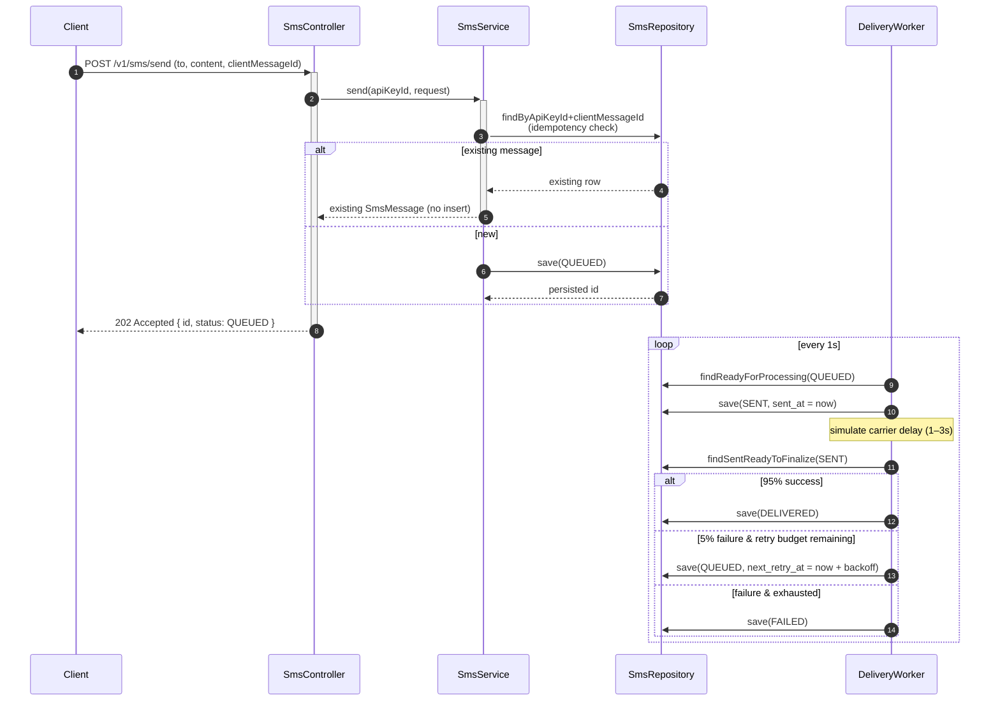

# VietSMS Gateway


A telecom-style SMS / OTP gateway API simulator, built with Spring Boot 3 and Java 21.

The shape of the service mirrors what a Vietnamese carrier (Viettel, Vinaphone, Mobifone) actually sells to banks, e-wallets, and e-commerce platforms: clients hold an API key, hit a REST endpoint to enqueue an SMS or OTP, and the system handles delivery asynchronously with retries, status reporting, and audit trails.

This repository is a multi-day build. Each day is roughly a two-hour focused session that adds one well-scoped slice of the system.

## Why this project

Most portfolio projects are todo lists, blog clones, or e-commerce demos. They prove a candidate can wire CRUD; they do not prove the candidate understands a domain or production engineering.

This service is intentionally narrow and intentionally Viettel-flavored. The architecture covers patterns that come up in real telecom systems:

- API key authentication with BCrypt-hashed storage and 8-char prefix lookup
- Sliding-window rate limiting per (API key, endpoint), with `Retry-After` and `X-RateLimit-*` headers
- Asynchronous delivery worker with a state machine, exponential-backoff retries, and configurable batch size
- Idempotency on accept (`client_message_id`)
- OTP issuance with TTL, attempt locking after N wrong tries, and per-phone send cooldown
- Audit logging with per-request `X-Request-Id` correlation
- Vietnamese phone number validation and normalization (`0xxx` ↔ `+84xxx`)
- Micrometer / Prometheus metrics for every domain event (`vietsms_sms_*`, `vietsms_otp_*`)
- OpenAPI / Swagger documentation with try-it-now examples

## Architecture

```mermaid
flowchart LR
    Client[Client] -->|x-api-key| Filters
    subgraph Filters[Filter chain]
        AuthF[ApiKeyAuthFilter] --> AuditF[AuditFilter] --> RLF[RateLimitFilter]
    end
    RLF --> Ctrl[Controllers /v1/...]
    Ctrl --> Svc[SmsService / OtpService]
    Svc --> Repo[(JPA Repositories)]
    Repo --> DB[(H2 / PostgreSQL)]
    Worker[DeliveryWorker @Scheduled] --> Repo
    Svc -.metrics.-> M[Micrometer]
    Worker -.metrics.-> M
    M --> Prom[/actuator/prometheus]
    AuditF --> Repo
```

The filter chain enforces auth first, then assigns a request id (audit), then applies rate limits. Controllers receive an authenticated `ApiKey` principal via Spring Security's `@AuthenticationPrincipal`, so they never have to re-validate it. Long-running work (delivery) lives in a `@Scheduled` worker rather than the request thread.

### SMS lifecycle



## Stack

| Layer | Technology |
|---|---|
| Language | Java 21 |
| Framework | Spring Boot 3.3 |
| Build | Maven |
| Persistence | Spring Data JPA + Flyway, H2 (dev), PostgreSQL (planned) |
| Security | Spring Security with a custom `OncePerRequestFilter` |
| Validation | Jakarta Bean Validation |
| Docs | springdoc-openapi |
| Tests | JUnit 5, MockMvc, AssertJ |

## Quick start

### With Docker (recommended)

```bash
docker compose up --build
```

On first start the application creates an H2 database under the `vietsms-data` volume, applies Flyway migrations, and prints a demo API key to the container log. Tail with `docker compose logs -f vietsms` and copy the key.

### With Maven (local JDK 21)

```bash
mvn spring-boot:run
```

On first start the application creates an H2 database under `./data/`, applies Flyway migrations, and prints a demo API key to the console:

```
=========================================================
  VietSMS demo API key (save this — shown only once)
  vsms_AbCdEf...
=========================================================
```

Save this key. It is the only credential issued automatically.

Endpoints once the app is running:

- Swagger UI: <http://localhost:8080/swagger-ui.html>
- H2 console: <http://localhost:8080/h2-console>
- Health: <http://localhost:8080/actuator/health>
- Prometheus metrics: <http://localhost:8080/actuator/prometheus> (filter `vietsms_*` counters for domain events)
- Error code catalog: [`docs/error-codes.md`](docs/error-codes.md)
- Architecture and design rationale: [`docs/architecture.md`](docs/architecture.md)

### Smoke test

```bash
# Wrong key → 401
curl -i http://localhost:8080/v1/ping

# Correct key → 200 with key metadata
curl -i -H "x-api-key: vsms_<the-key-you-saved>" http://localhost:8080/v1/ping
```

## Configuration

All settings live in `src/main/resources/application.yml`. Common overrides:

| Property | Default | Description |
|---|---|---|
| `vietsms.delivery.worker-interval-ms` | `1000` | How often the delivery worker ticks |
| `vietsms.delivery.batch-size` | `50` | Max messages picked per tick |
| `vietsms.delivery.success-rate` | `0.95` | Simulated carrier success probability |
| `vietsms.delivery.min-delay-ms` | `1000` | Earliest moment a SENT message can finalize |
| `vietsms.delivery.max-retries` | `3` | Retry budget before terminal FAILED |
| `vietsms.ratelimit.sms-per-minute` | `10` | Sliding-window limit for `/v1/sms/send` |
| `vietsms.ratelimit.otp-per-minute` | `5` | Sliding-window limit for `/v1/otp/send` |
| `vietsms.ratelimit.otp-per-phone-cooldown-seconds` | `30` | Min interval between OTPs for the same phone |
| `vietsms.otp.default-length` | `6` | OTP code length when client omits the field |
| `vietsms.otp.default-ttl-seconds` | `300` | OTP TTL when client omits the field |
| `vietsms.otp.max-attempts` | `3` | Wrong attempts before LOCKED |

Any property can be overridden via env (`VIETSMS_DELIVERY_SUCCESS_RATE=0.5`), `--key=value` CLI args, or a profile-specific `application-<profile>.yml`.

## Testing

```bash
mvn verify
```

This runs the full suite (currently **52 tests**, all green) and produces a JaCoCo coverage report at `target/site/jacoco/index.html`. Per-package instruction coverage typically lands at:

| Package | Coverage |
|---|---|
| `config`, `seed`, `sms.dto`, `validation` | 100% |
| `security` | 90% |
| `ratelimit` | 87% |
| `sms` | 85% |
| `otp` | 79% |
| `audit` | 78% |
| `worker` | 66% |

Integration tests use `@ActiveProfiles("test")` to run against an in-memory H2 (see `src/test/resources/application-test.yml`). Awaitility waits for the delivery worker to transition messages without race conditions.

## Roadmap

The project is built in seven daily slices. Each day's deliverable is small but complete.

| Day | Theme | Status |
|---|---|---|
| 1 | Bootstrap: project skeleton, DB schema, API key auth, demo seeder, Swagger | **Done** |
| 2 | SMS endpoints (send, get, list) and the delivery worker with retries | **Done** |
| 3 | OTP endpoints (send, verify) with attempt locking and cooldown | **Done** |
| 4 | Rate limiting (sliding window) and audit logging | **Done** |
| 5 | Micrometer / Prometheus metrics, Swagger polish, error catalog | **Done** |
| 6 | Test coverage (JaCoCo) and documentation polish (architecture diagrams) | **Done** |
| 7 | Dockerfile, docker-compose, GitHub Actions CI | **Done** |

Design document lives at `docs/superpowers/specs/2026-05-18-vietsms-gateway-design.md`.

## Project layout

```
src/main/java/com/hoangcoder/vietsms/
  VietSmsApplication.java
  config/        # Security, OpenAPI
  security/      # ApiKey entity, filter, service
  sms/           # SMS controller, service, repository, status enum
  otp/           # OTP controller, service, repository
  worker/        # DeliveryWorker (scheduled)
  ratelimit/     # Sliding-window limiter and filter
  audit/         # AuditLog entity and writer
  validation/    # Vietnamese phone validator
  common/        # ApiError, GlobalExceptionHandler, PhoneNormalizer
  seed/          # Demo data seeder
src/main/resources/
  application.yml
  db/migration/  # Flyway migrations V1–V4
```

## License

MIT — see [`LICENSE`](LICENSE).
