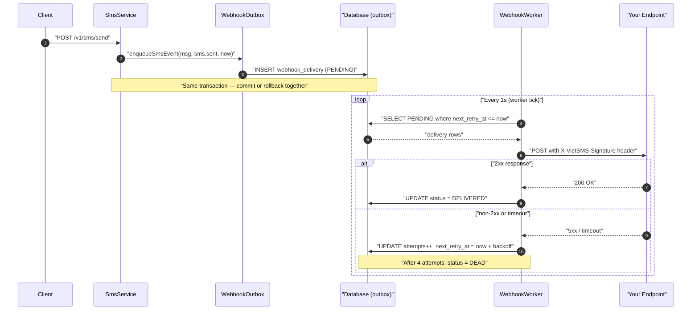

# Webhooks

Webhooks let you receive real-time HTTP notifications when events happen in your VietSMS account. Instead of polling the status endpoints, you register a URL and VietSMS POSTs a signed JSON payload to it whenever a matching event fires.

## Overview

1. Register an endpoint (`POST /v1/webhooks`) — you get back a one-time secret.
2. Events are written to an outbox table in the **same transaction** as the business state change, so they never diverge.
3. `WebhookWorker` polls the outbox every second, signs each payload, and POSTs to your URL.
4. If your server returns a non-2xx response (or times out), the delivery is retried with exponential back-off.

---

## Endpoints

### Register an endpoint

```bash
curl -s -X POST http://localhost:8080/v1/webhooks \
  -H "x-api-key: $KEY" \
  -H "content-type: application/json" \
  -d '{
    "url": "https://your-server.example.com/webhooks/vietsms",
    "events": ["sms.sent", "sms.delivered", "sms.failed"]
  }' | jq
```

Response (201):

```json
{
  "id": 1,
  "url": "https://your-server.example.com/webhooks/vietsms",
  "events": ["sms.sent", "sms.delivered", "sms.failed"],
  "secret": "a3f8d2e1c0b94567..."
}
```

**Save the secret now** — it is returned only once on registration and never included in subsequent responses.

---

### List endpoints

```bash
curl -s -H "x-api-key: $KEY" http://localhost:8080/v1/webhooks | jq
```

Response (200) — secret is **never** included:

```json
[
  {
    "id": 1,
    "url": "https://your-server.example.com/webhooks/vietsms",
    "events": ["sms.sent", "sms.delivered", "sms.failed"],
    "enabled": true
  }
]
```

---

### Delete an endpoint

```bash
curl -s -X DELETE -H "x-api-key: $KEY" http://localhost:8080/v1/webhooks/1
# 204 No Content on success; 404 if not found or owned by a different key
```

---

### Fire a test delivery

Enqueues a `webhook.test` event to verify your endpoint is reachable before going live.

```bash
curl -s -X POST -H "x-api-key: $KEY" http://localhost:8080/v1/webhooks/1/test | jq
```

Response (202):

```json
{ "deliveryId": 42 }
```

The `WebhookWorker` will POST to your URL within the next worker tick (default: 1 second). Inspect the result:

```bash
curl -s -H "x-api-key: $KEY" \
  "http://localhost:8080/v1/webhooks/1/deliveries?status=DELIVERED" | jq

# Or check for failures:
curl -s -H "x-api-key: $KEY" \
  "http://localhost:8080/v1/webhooks/1/deliveries?status=DEAD" | jq
```

---

### Inspect delivery history

```bash
# status: PENDING | DELIVERED | FAILED | DEAD
curl -s -H "x-api-key: $KEY" \
  "http://localhost:8080/v1/webhooks/1/deliveries?status=DEAD" | jq
```

---

## Event catalog

| Wire name | Trigger | Status |
|---|---|---|
| `sms.sent` | SMS accepted and sent to the simulated carrier | Live |
| `sms.delivered` | Carrier confirms delivery | Live |
| `sms.failed` | Delivery permanently failed after exhausting retries | Live |
| `webhook.test` | Manual test-fire via `POST /v1/webhooks/{id}/test` | Live |
| `otp.locked` | OTP locked after too many wrong attempts | Planned |

---

## Delivery semantics

- **At-least-once**: a delivery may be attempted more than once (e.g., if the app restarts mid-delivery). Your handler should be idempotent — use the `X-VietSMS-Delivery-Id` header to deduplicate.
- **Ordering not guaranteed**: retried deliveries may arrive out of order relative to newer events.
- **Retry schedule** (exponential back-off):

  | Attempt | Delay before next retry |
  |---|---|
  | 1st failure | 1 minute |
  | 2nd failure | 5 minutes |
  | 3rd failure | 30 minutes |
  | 4th failure | Dead-lettered (`DEAD`) |

- **DEAD deliveries**: after 4 failed attempts the delivery is marked `DEAD` and no further retries occur. Inspect via `GET /v1/webhooks/{id}/deliveries?status=DEAD`. You can re-trigger for the same event with a new test fire; there is no replay endpoint for production events.
- **Timeout**: each outgoing POST has a 5-second connect + read timeout (configurable via `vietsms.webhooks.timeout-ms`).
- **Success criterion**: any 2xx HTTP response code.

---

## Signature verification

Every POST from VietSMS carries three headers:

| Header | Example value |
|---|---|
| `X-VietSMS-Signature` | `sha256=3d4f2a1b...` |
| `X-VietSMS-Event` | `sms.delivered` |
| `X-VietSMS-Delivery-Id` | `42` |

The signature is HMAC-SHA256 over the **raw request body bytes**, hex-encoded, prefixed with `sha256=`:

```
signature = "sha256=" + HEX( HMAC-SHA256(secret, rawBodyBytes) )
```

### Java verification snippet

```java
import javax.crypto.Mac;
import javax.crypto.spec.SecretKeySpec;
import java.security.MessageDigest;
import java.util.HexFormat;

public boolean verifySignature(String secret, byte[] bodyBytes, String signatureHeader) {
    try {
        Mac mac = Mac.getInstance("HmacSHA256");
        mac.init(new SecretKeySpec(secret.getBytes(java.nio.charset.StandardCharsets.UTF_8), "HmacSHA256"));
        byte[] expected = mac.doFinal(bodyBytes);
        String expectedHex = "sha256=" + HexFormat.of().formatHex(expected);
        // Constant-time comparison to prevent timing attacks
        return MessageDigest.isEqual(
            expectedHex.getBytes(java.nio.charset.StandardCharsets.UTF_8),
            signatureHeader.getBytes(java.nio.charset.StandardCharsets.UTF_8)
        );
    } catch (Exception e) {
        return false;
    }
}
```

### Python verification snippet

```python
import hmac
import hashlib

def verify_signature(secret: str, body: bytes, signature_header: str) -> bool:
    """Verify X-VietSMS-Signature using HMAC-SHA256."""
    mac = hmac.new(secret.encode(), body, hashlib.sha256)
    expected = "sha256=" + mac.hexdigest()
    # hmac.compare_digest prevents timing attacks
    return hmac.compare_digest(expected, signature_header)
```

### Secret storage trade-off

v1 stores webhook secrets **in plaintext** in the database (the `webhook_endpoint.secret` column). This is acceptable for a development/portfolio context but is a known limitation: anyone with database read access can see secrets. Future hardening options include encryption-at-rest, a KMS-wrapped column, or integration with HashiCorp Vault. The secret is never returned after registration, so it cannot be leaked via the API.

---

## Flow diagram


